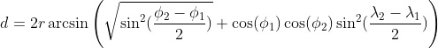

## Ejercicio 1
Para leer el fichero CSV proporcionado e imprimir cada linea se plantean dos opciones. La primera
de ellas es utilizar la libreria csv donde se utiliza reader para leer el fichero y posteriormente imprimir linea a linea. La segunda opcion planteada es utilizar un dataframe de Pandas que lee el fichero csv e imprimir todas las filas del dataframe. Esta opcion de utilizan dataframes de Pandas se ha descartado en ejercicios posteriores por lo requesitos de cada ejercicio.

## Ejercicio 2
Continuando la primera solucion del ejercicio anterior se lee el fichero CSV a partir de la libreria csv, donde cada fila se almacena en una lista, la cual se serializa en un objeto JSON que se escribe en un fichero reto.json

## Ejercicio 3
Se lee el fichero JSON, de los cuales se leen la matricula y la distancia de cada linea del fichero. Se calcula la suma total de distancias por cada matricula y los resultados se almacenan en un diccionario donde las claves son la matriculas y el valor son las distancias totales

## Ejercicio 4
De manera similar al anterior caso se leen del fichero JSON la matricula y las coordenadas (latitud y longitud). Para calcular la distancia entre dos puntos se ha utilizado la Fórmula de Harvesine Fórmula del semiverseno. Esta fórmula se utiliza para calcular la distancia entre dos puntos conocidos, con su latitud y longitud, en la superficie de una esfera



A traves de la implementacion de esta formula, se calcula la distancia en Km a partir de un punto y el punto inmediantamente anterior, definidos por sus latitudes y longitudes. Primero se convierten las latitudes y longitudes en radianes, despues se calculan las diferencias entre longitudes y latitudes. El simbolo Phi representa la latitud en radianes, mientras que el simbolo Lambda representa la longitud en radianes. 
Se observan discrepancias entre los distintos valores, asumo que se debe a que los valores de la columna Distance estan representados en una magnitud distinta que los valores calculados con la Fórmula de Harvesine

## Ejercicio 5
En este caso se leen la matricula y la fecha en formato POSIX del fichero JSON. La fecha en POSIX se convierte al formato (dd/mm/YYY HH:MM:SS) utilizando la libreria datetime y se formatea al formato requerido utilizando la siguiente función
```python
def conversion_posix_date(pos_date):
    fecha = datetime.fromtimestamp(pos_date / 1000)
    return fecha.strftime('%d/%m/%Y %H:%M:%S')
```
Se lee la fecha mas reciente por matricula y posteriormente se ordenan de mas reciente a más antigua. Por ultimo se escribe en un fichero TXT la matricula con su fecha correspondiente

## Ejercicio 6 
Se crea una API REST que escucha peticiones GET utilizando Flask. Flask es un frameqork que permite la creacion de APIs REST de manera simple. La API se incializa con
```python
api = Flask(__name__)
```

Se crea una función que se encarga de leer el fichero generado en el ejercicio anterior, separar la matricula y la fecha, y almacenarlas en un diccionario donde la matrícula es la clave y la fecha es el valor.
La ruta definida en la API es /<matricula>, esto significa que cualquier consulta que siga el formato http://localhost/XXX será procesada, donde XXX es la matrícula del vehículo. La funcion get_vehiculo(matricula) se encarga de comprobar que la matricula existe en el diccionario anterior. Si esta existe devuelve un JSON con la matricula y la fecha. En caso contrario se devuelve un error 404.

## Ejercicio 7
Se ha decidido utilizar PostgreSQL como base de datos para este ejercicio debido a que en una API GET solo se utilizarán operaciones SELECT para leer las peticiones GET e INSERT para poblar la base de datos en un inicio.
Se crea un fichero de configuracion de Docker donde se define la base de datos a utilizar, PostgreSQL con su versión 17, con el nombre vehiculos_db y que escucha en el puerto 5432.

Dentro de la base de datos se define una tabla vehiculos con dos columnas:
- matricula: que será la matrícula del vehículo. Es la clave primaria de la columna.
- fecha: que almacena la última fecha de posición del vehículo.

Por ultimo, se tiene un fichero en Python que se encarga de leer los datos del fichero txt generado anteriormente y procesar los datos para ejecutar una sentencia SQL que se encarga de poblar la tabla vehiculos. Para conectarse a la base de datos de PostgreSQL desplegada en el contenedor Docker se utiliza la libreria psycopg2, donde se define la connect que se encarga de mantener la conexión activa entre el cliente y la base de datos,  y un cursor que es el intermediario en la conexion, a traves del cursor se pueden hacer consultas SQL:
```python
conn = psycopg2.connect(
    dbname="vehiculos_db", user="admin", password="password", host="localhost", port='5432'
)
cursor =conn.cursor()
```
Se ejcuta con el cursor la siguiente sentencia SQL que se encarga de poblar la tabla vehiculos:
```python
cursor.execute("""
                    INSERT INTO vehiculos (matricula, fecha) 
                    VALUES (%s, %s)
                """, (matricula, fecha))
```
Una vez se ha poblado la tabla se realiza un commit() para confirmar los cambios y guardarlos de forma permanente. Por ultimo se cierran el cursor y la conexión
[!NOTE]
Para levantar el contenedor
```sh
docker-compose up -d
```
Para conectarse al contenedor
```sh
docker-compose up -d
```
Una vez conectado, para crear la tabla que almacenara los valores de los vehículos:
```sql
CREATE TABLE vehiculos (
    matricula VARCHAR(255) PRIMARY KEY,
    fecha TIMESTAMP
);
```

## Ejercicio 8
Siguiendo el codigo del ejercicio 6 y del ejercicio 7 se crea una API REST con Flask, donde las peticiones GET siguen el formato http://localhost/XXX. En este caso se cargan los datos ejecutando una consulta SQL donde se seleccionan todos los datos de la tabla vehiculos y se almacenan en un diccionario. Posteriormente se consulta si una matricula esta en el diccionario con los datos de la base de datos. Si la matricula existe se devuelve un JSON con la matricula y la fecha. En caso contrario se devuelve un error 404.
```python
conn = psycopg2.connect(
    dbname="vehiculos_db", user="admin", password="password", host="localhost", port='5432'
)
cursor =conn.cursor()

def load_datos_db():
    
    vehiculos =  cursor.execute("""
                    SELECT * FROM vehiculos
                """)
            
    conn.commit()  
    vehiculos = cursor.fetchall()  
    cursor.close()
    conn.close() 
    vehiculos_dict = {row[0]: row[1] for row in vehiculos}
    return vehiculos_dict
```

Otra posible solución con el objetivo de optimizar la ejecuccion del programa seria ejecutar una consulta que compruebe la existencia de la matricula en la base de datos, y en caso de existir devuelva todo el contenido de la fila donde se encuentra la matricula. Esto se aplicaría en casos donde la base de datos crezca mucho y no sea eficiente cargar todo su contenido en memoria. 
```sql
SELECT * FROM vehiculos WHERE matricula = %s
```
